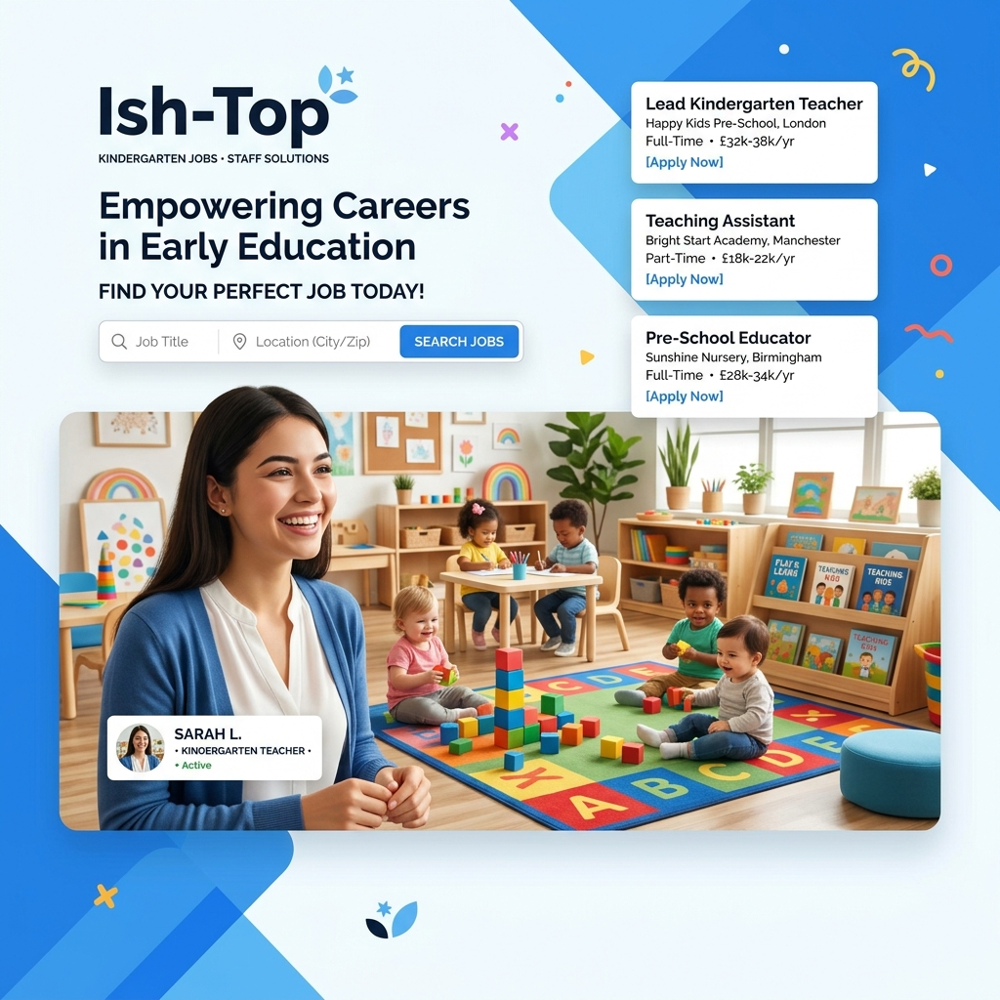

# 🌟 Ish-Top — Платформа для поиска персонала в детские сады

**Ish-Top** — это современная специализированная платформа, объединяющая квалифицированных специалистов и работодателей в сфере дошкольного образования. Наше решение предоставляет бесшовный опыт поиска работы и подбора кадров, интегрированный в экосистему Telegram.

---

## ✨ Ключевые возможности

### 👔 Для Работодателей
- **Масштабный поиск:** База проверенных специалистов (воспитатели, няни, повара, методисты).
- **Управление вакансиями:** Создание, редактирование и продвижение объявлений.
- **Интеллектуальный отбор:** Удобная воронка откликов и фильтрация кандидатов.
- **Прямая связь:** Встроенный чат для обсуждения деталей.

### 👩‍🏫 Для Соискателей
- **Персональный профиль:** Цифровое резюме, адаптированное под стандарты отрасли.
- **Умные фильтры:** Поиск по локации, зарплате, графику и специализации.
- **Мгновенные отклики:** Подача заявки в один клик.
- **Избранное:** Сохранение интересных предложений "на потом".

---

## 🛠️ Технологический стек

Проект построен на передовых технологиях, обеспечивающих высокую скорость работы и надежность:

| Frontend | Backend | Инфраструктура |
| :--- | :--- | :--- |
| **React + Vite** | **FastAPI (Python)** | **PostgreSQL** |
| **Tailwind CSS** | **SQLAlchemy (Async)** | **Alembic (Migrations)** |
| **Material UI & Radix** | **Pydantic v2** | **Telegram SDK** |
| **Sonner (Notifications)** | **python-jose (Auth)** | **GitHub / Render** |

---

## 📱 Telegram Mini App Ready

Платформа полностью оптимизирована для работы внутри **Telegram WebApp**:
- **Safe Area Support:** Идеальное отображение на всех мобильных устройствах (iOS/Android).
- **Theme Sync:** Автоматическая адаптация под темную/светлую тему пользователя.
- **Native UI:** Интерфейс, который ощущается как нативное приложение.

---

## 📂 Структура проекта

*   `/frontend` — Клиентская часть на React.
*   `/backend` — Высокопроизводительный API сервер.
*   `/md_files` — Техническая документация и планы разработки.

---

## 🚀 Быстрый старт

### Бэкенд
1. Перейдите в `backend/`.
2. Настройте `.env` (БД PostgreSQL).
3. Запустите: `uvicorn app.main:app --reload`

### Фронтенд
1. Перейдите в `frontend/`.
2. Установите зависимости: `npm install`.
3. Запустите: `npm run dev`.

---

## 🏆 Статус проекта: ЗАВЕРШЕНО (100%)

Все этапы разработки, включая интеграцию API, безопасность и финальную полировку интерфейса, успешно выполнены. Проект готов к полноценной эксплуатации и масштабированию.

---

> Разработано с использованием современных практик UI/UX дизайна. Оригинальные макеты доступны в [Figma](https://www.figma.com/design/M16nNVy7FrScwmfjjFoVnZ/ish-top).